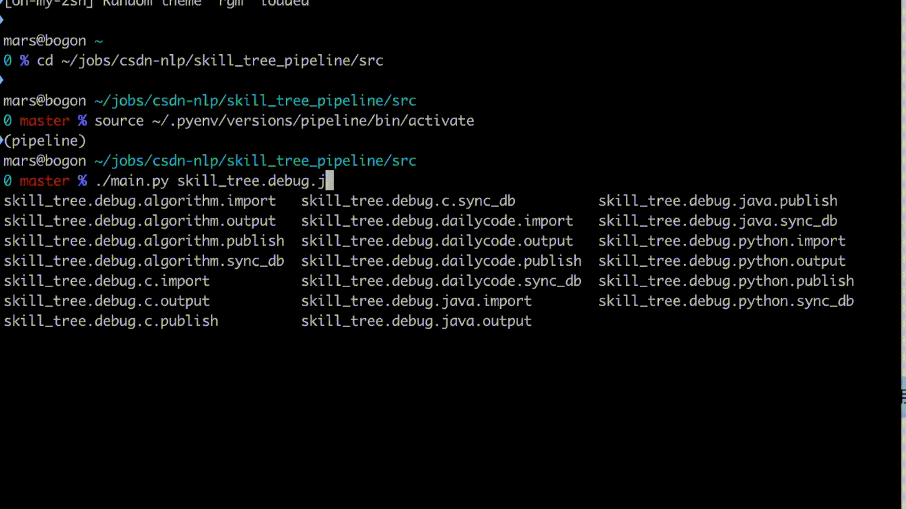

# Pyouter

Pyouter is a tasks router by  hierarchy and layered tasks, which may come from command line or http restful api

Deepwki: https://deepwiki.com/fanfeilong/pyouter



## INSTALL

install pyouter

```shell
pip install pyouter
```

* advanced: [install for shell completion support](./advanced.md)

## examples

* [src/tests/test.py](src/tests/test.py)
  * depends: [src/tests/config.json](src/tests/config.json)

minimal example code for pyouoter:

```python
from typing import Any
from pyouter.app import App
from pyouter.router import Router

import json
import asyncio
import time


async def hello(config, options):
    print("hello function")
    
def hello_sync(config, options):
    print("hello sync")

class Hello:
    def __init__(self, value) -> None:
        self.value = value
    
    # Router class SHOULD provider method: `run(self, config, options)`
    async def run(self, config, options) -> Any:
        self.config = config
        self.options = options
        await self.inner()
    
    async def inner(self):
        print(f"run Hello, {self.value}")
        await asyncio.sleep(2)
        print(f"hello class object, self.options.debug:{self.options.debug}, sleep 2s")
        if self.options.debug:
            print(f'debug, {self.value}')
            
class Hello_Sync:
    def __init__(self, value) -> None:
        self.value = value
    
    # Router class SHOULD provider method: `run(self, config, options)`
    def run(self, config, options) -> Any:
        self.config = config
        self.options = options
        self.inner()
    
    def inner(self):
        print(f"run Hello_Sync, {self.value}")
        time.sleep(self.value)
        print(f"hello class object, self.options.debug:{self.options.debug}, sleep {self.value}s")
        if self.options.debug:
            print(f'debug, {self.value}')

if __name__=="__main__":
    '''
    Usage:
        ## execute:
        * python test.py test.hello.func
        * python test.py test.hello.obj
        * python test.py test
        
        ## dump router path only:
        * python test.py test.hello -i
        * python test.py test.hello --insepect
        
        ## dump router path and execute:
        * python test.py test.hello -v
        * python test.py test.hello --view
    '''
    
    app = App(
        config='config.json',
    )
    
    app.option(
        '-d', '--debug',
        dest='debug',
        action="store_true",
        help='debug'
    )
    
    app.use(
        router=Router(
            test=Router(
                hello=Router(
                    func=hello,
                    obj=Hello("world"),
                    obj2=Hello_Sync(10)
                ),
                hello2=hello,
                hello3=Router(
                    func=hello_sync,
                    obj=Hello("world"),
                    obj2=Hello_Sync(20),
                )
            )
        )
    )
    
    app.run()
    
    
```

## What's new

### 0.1.0

* fix executor bug

### 0.0.9

* improve -v, --view, -i, --insepect option for path debug

### 0.0.8

* add app.option support
* improve App(config=), support config patth
* add aysnc support
* will execute all routers pallarent by using async ThreadPoolExecutor

### 0.0.7

* add pyouter self completion of bash and fish

### 0.0.6

* fixed bug in fish completion install

### 0.0.5

* pass config if need

### 0.04

* custom parser

### 0.0.3

* support pyouter completion
* pyouter as entry points of package

### 0.0.2

* rename plugin to pyouter

### 0.0.1

* project init
* add pypi settings
* add installer
